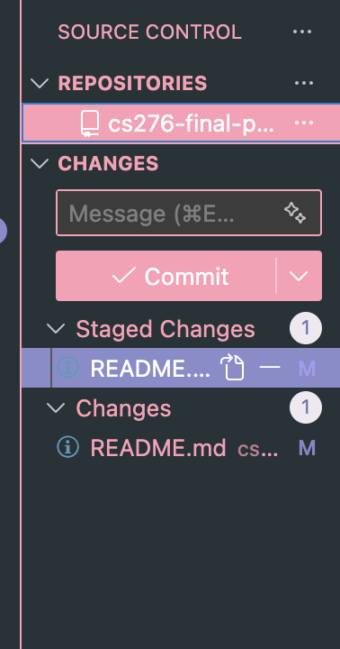

# cs276-final-project
 
in order to make changes to the repo, do as following:
1. add every change you've made to the staging stage: git add .
2. commit the changes to your local repo: git commit -m "ADD MESSAGE HERE OR ELSE IT WILL NOT WORK"
3. push the changes to the remote repo: git push
4. when there's new changes your partner made, pull that from the remote repo to local repo: git pull

easier way: just let the extension handle, but it would look cooler if you use terminal
